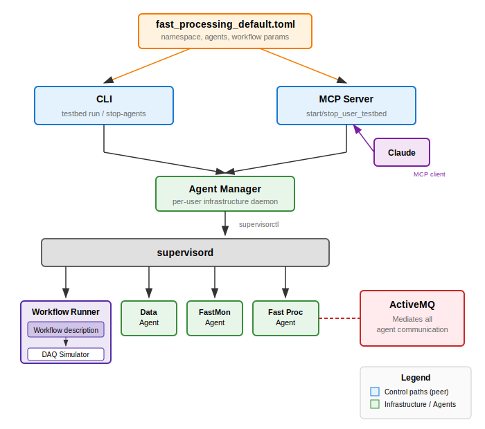
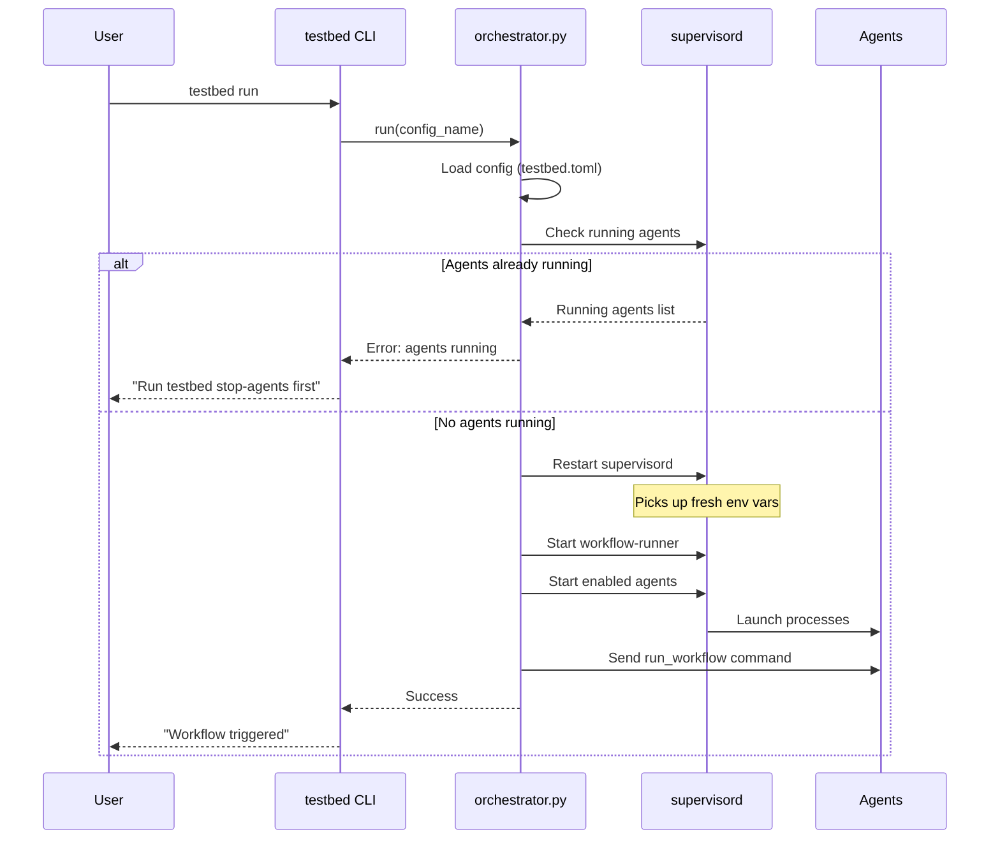
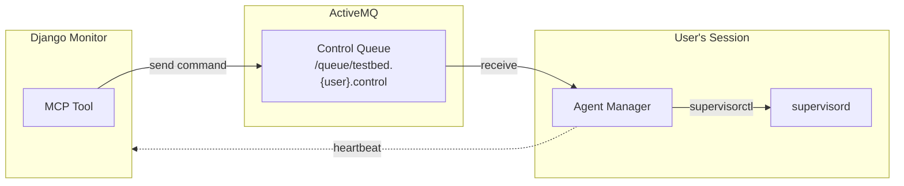
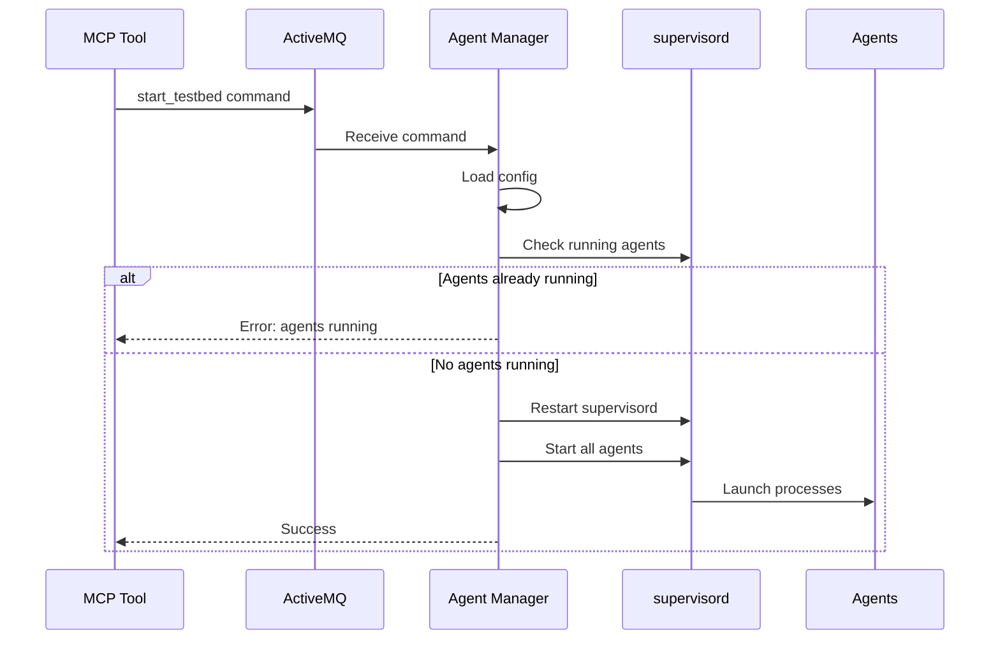
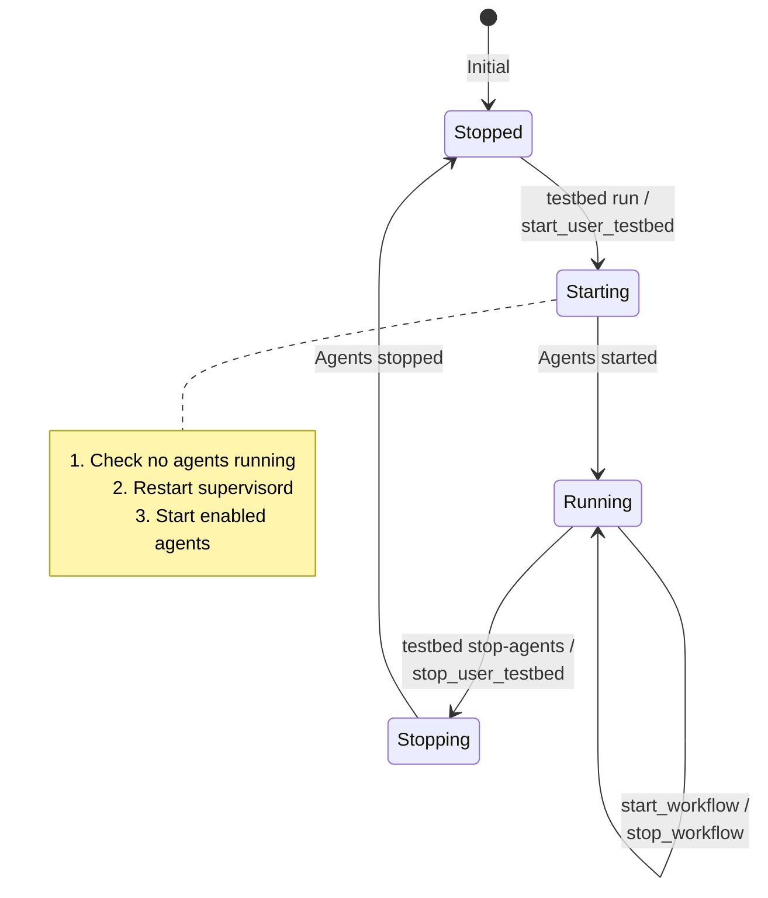

# Agent Management

This document describes how workflow agents are started, stopped, and managed in the ePIC Streaming Workflow Testbed.

## Overview

Agents are managed through two control paths:
- **CLI** (`testbed` command) - for local operation
- **MCP** (Model Context Protocol) - for AI-assisted remote operation

Both paths use supervisord for process management, ensuring consistent behavior.



## CLI Control Path

### Starting Agents and Workflows

```bash
testbed run                     # Uses workflows/testbed.toml
testbed run fast_processing     # Uses workflows/fast_processing_default.toml
```

**Startup sequence:**



### Stopping Agents

```bash
testbed stop-agents             # Stop all workflow agents
```

This command:
1. Connects to supervisord using `agents.supervisord.conf`
2. Issues `supervisorctl stop all`
3. All agent processes are terminated

**Important:** `testbed stop-agents` uses `agents.supervisord.conf` (for workflow agents), not `supervisord.conf` (which manages web services).

## MCP Control Path

### Agent Manager Daemon

The Agent Manager is a per-user daemon that bridges MCP commands to local supervisord:

```bash
testbed agent-manager           # Run in foreground
nohup testbed agent-manager &   # Run in background
```

The daemon:
- Listens on `/queue/testbed.{username}.control`
- Sends heartbeats to the monitor
- Executes start/stop commands via supervisorctl



### MCP Tools

```python
# Check agent manager status
check_agent_manager(username)

# Start testbed (agents + workflow runner)
start_user_testbed(username, config_name="testbed.toml")

# Stop all agents
stop_user_testbed(username)

# Start a workflow (after agents are running)
start_workflow(namespace="torre2", stf_count=10)

# Stop a running workflow
stop_workflow(execution_id="stf_datataking-wenauseic-0049")

# Comprehensive status
get_testbed_status(username)
```

### MCP Startup Sequence



## Configuration

### testbed.toml Structure

```toml
[testbed]
namespace = "torre2"              # Isolation namespace

[agents.data]
enabled = true                    # Enable this agent
script = "example_agents/example_data_agent.py"

[agents.fastmon]
enabled = true

[agents.fast_processing]
enabled = true

[workflow]
name = "stf_datataking"           # Default workflow
config = "fast_processing_default"
realtime = true
```

### Environment Variables

Supervisord passes environment variables to agents:

```ini
# agents.supervisord.conf
[program:example-data-agent]
command=python example_agents/example_data_agent.py
directory=%(ENV_SWF_HOME)s/swf-testbed
environment=SWF_TESTBED_CONFIG="%(ENV_SWF_TESTBED_CONFIG)s"
autostart=false
autorestart=true
```

Key variables:
| Variable | Purpose |
|----------|---------|
| `SWF_HOME` | Parent directory containing swf-* repos |
| `SWF_TESTBED_CONFIG` | Path to testbed.toml |
| `SWF_MONITOR_HTTP_URL` | Monitor REST API URL |
| `SWF_API_TOKEN` | API authentication token |

**Important:** Supervisord must be restarted to pick up environment variable changes. Both CLI and MCP paths automatically restart supervisord on start.

## Process Lifecycle



## Troubleshooting

### Agents Won't Start: "agents already running"

```bash
# Check what's running
supervisorctl -c agents.supervisord.conf status

# Stop existing agents
testbed stop-agents

# Now start fresh
testbed run
```

### Wrong Namespace

Agents use the namespace from the config file that was active when supervisord started. If agents are using the wrong namespace:

```bash
testbed stop-agents
# Edit testbed.toml or set SWF_TESTBED_CONFIG
testbed run
```

The restart of supervisord picks up the new configuration.

### Agent Manager Not Responding

```bash
# Check if agent manager is running
ps aux | grep user_agent_manager

# Check MCP status
# (via MCP tool)
check_agent_manager(username)

# Restart agent manager
pkill -f user_agent_manager
nohup testbed agent-manager &
```

## See Also

- [Architecture Overview](architecture.md) - System design and components
- [Fast Processing Workflow](fast-processing-workflow.md) - Workflow sequence diagram
- [Operations Guide](operations.md) - Day-to-day operations
