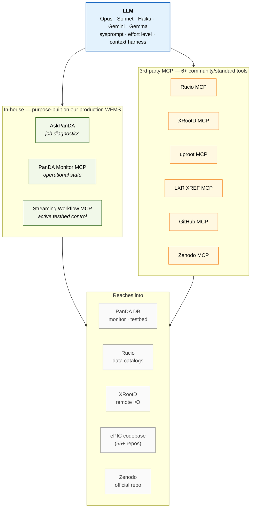

# diagram2_mcp_ecosystem

MCP ecosystem: one LLM reaches into the experiment's operational stack
through a two-tier tool set. Answers the reviewer who thinks "everyone
has MCP tools now" by showing depth into production systems.

