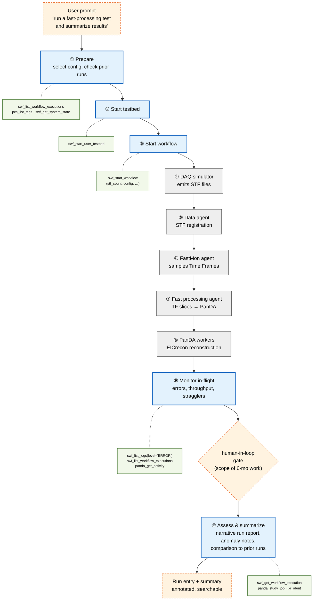

# diagram3_hybrid_workflow

```mermaid
flowchart TB
    classDef llm fill:#e3f2fd,stroke:#1565c0,stroke-width:2px,color:#000
    classDef det fill:#eeeeee,stroke:#555,color:#000
    classDef hitl fill:#fff3e0,stroke:#e65100,stroke-dasharray:5 3,color:#000
    classDef mcp fill:#f1f8e9,stroke:#33691e,font-size:11px,color:#000

    U["User prompt<br/>'run a fast-processing test<br/>and summarize results'"]:::hitl

    L1["① Prepare<br/>select config, check prior runs"]:::llm
    L1t["swf_list_workflow_executions<br/>pcs_list_tags · swf_get_system_state"]:::mcp

    L2["② Start testbed"]:::llm
    L2t["swf_start_user_testbed"]:::mcp

    L3["③ Start workflow"]:::llm
    L3t["swf_start_workflow<br/>(stf_count, config, …)"]:::mcp

    D1["④ DAQ simulator<br/>emits STF files"]:::det
    D2["⑤ Data agent<br/>STF registration"]:::det
    D3["⑥ FastMon agent<br/>samples Time Frames"]:::det
    D4["⑦ Fast processing agent<br/>TF slices → PanDA"]:::det
    D5["⑧ PanDA workers<br/>EICrecon reconstruction"]:::det

    L4["⑨ Monitor in-flight<br/>errors, throughput, stragglers"]:::llm
    L4t["swf_list_logs(level='ERROR')<br/>swf_list_workflow_executions<br/>panda_get_activity"]:::mcp

    G1{"human-in-loop<br/>gate<br/>(scope of 6-mo work)"}:::hitl

    L5["⑩ Assess & summarize<br/>narrative run report,<br/>anomaly notes,<br/>comparison to prior runs"]:::llm
    L5t["swf_get_workflow_execution<br/>panda_study_job · lxr_ident"]:::mcp

    O["Run entry + summary<br/>annotated, searchable"]:::hitl

    U --> L1 --> L2 --> L3 --> D1 --> D2 --> D3 --> D4 --> D5 --> L4
    L4 --> G1 --> L5 --> O

    L1 -.- L1t
    L2 -.- L2t
    L3 -.- L3t
    L4 -.- L4t
    L5 -.- L5t
```
