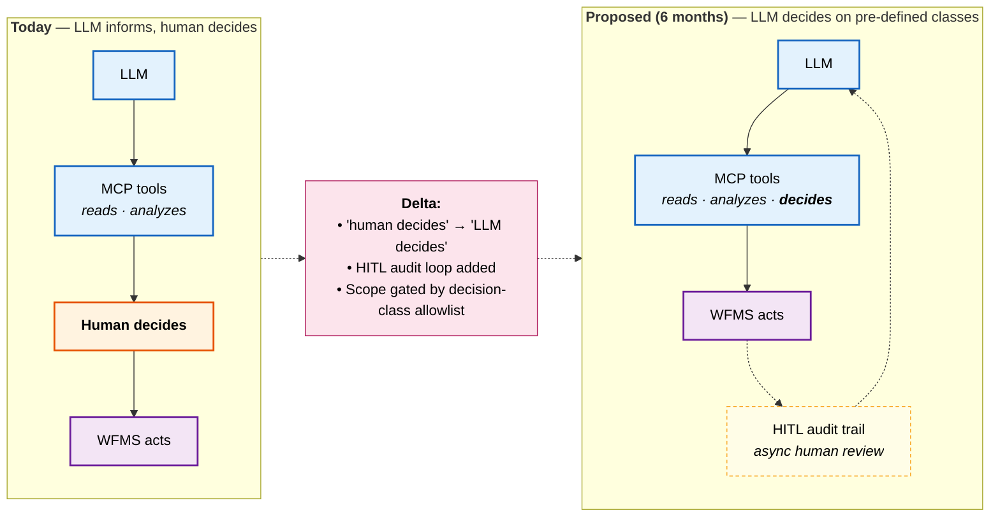

# diagram4_delta_before_after

The 6-month delta visualized. Same boxes, one arrow moves, one audit
loop added. Makes the project feel like a bounded increment on an
operational system, not a research leap.

