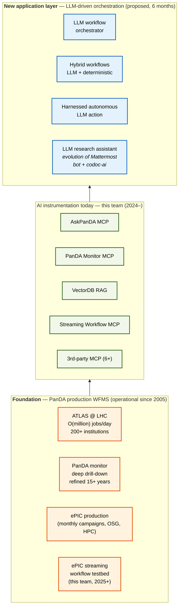

# diagram5_panda_provenance

Scale-provenance stack. The "why 6 months is plausible" anchor: we're
layering on a production WFMS with a decade of operational history,
not starting from zero.

```mermaid
flowchart BT
    classDef app fill:#e3f2fd,stroke:#1565c0,stroke-width:2px,color:#000
    classDef ai fill:#f1f8e9,stroke:#33691e,stroke-width:2px,color:#000
    classDef panda fill:#fff3e0,stroke:#e65100,stroke-width:2px,color:#000

    subgraph L1["<b>Foundation</b> — PanDA production WFMS (operational since 2005)"]
        direction LR
        P1["ATLAS @ LHC<br/>O(million) jobs/day<br/>200+ institutions"]:::panda
        P2["PanDA monitor<br/>deep drill-down<br/>refined 15+ years"]:::panda
        P3["ePIC production<br/>(monthly campaigns, OSG, HPC)"]:::panda
        P4["ePIC streaming<br/>workflow testbed<br/>(this team, 2025+)"]:::panda
    end

    subgraph L2["AI instrumentation today — this team (2024–)"]
        direction LR
        I1["AskPanDA MCP"]:::ai
        I2["PanDA Monitor MCP"]:::ai
        I3["VectorDB RAG"]:::ai
        I4["Streaming Workflow MCP"]:::ai
        I5["3rd-party MCP (6+)"]:::ai
    end

    subgraph L3["<b>New application layer</b> — LLM-driven orchestration (proposed, 6 months)"]
        direction LR
        A1["LLM workflow<br/>orchestrator"]:::app
        A2["Hybrid workflows<br/>LLM + deterministic"]:::app
        A3["Harnessed autonomous<br/>LLM action"]:::app
        A4["LLM research assistant<br/><i>evolution of Mattermost<br/>bot + codoc-ai</i>"]:::app
    end

    L1 --> L2
    L2 --> L3
```
