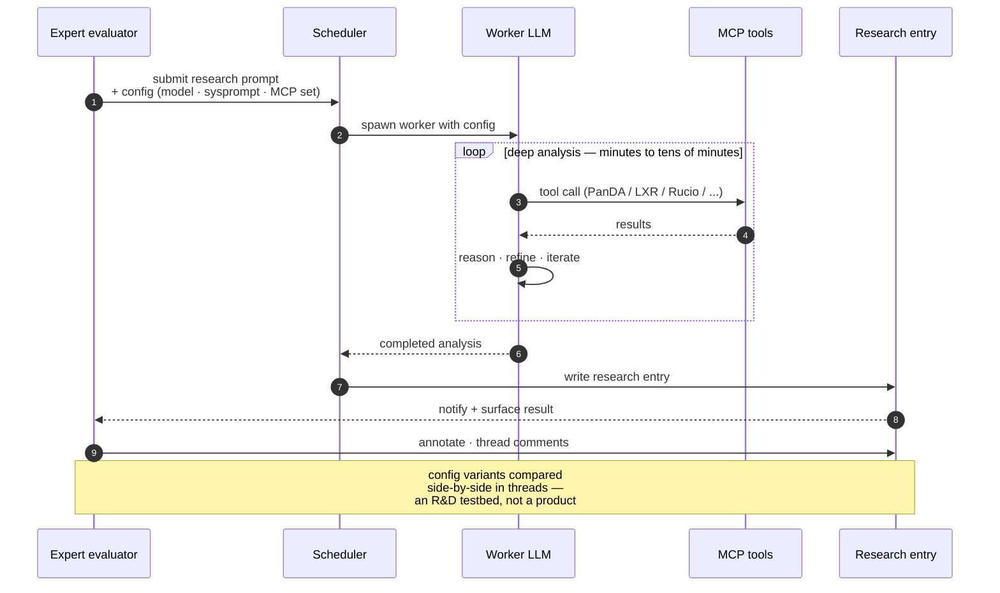

# diagram6_corunai_loop

corun-ai research loop — shows corun-ai is not a chatbot but an
orchestrated research system with config-compare as a first-class
feature.

```mermaid
sequenceDiagram
    autonumber
    participant U as Expert evaluator
    participant S as Scheduler
    participant W as Worker LLM
    participant M as MCP tools
    participant E as Research entry

    U->>S: submit research prompt<br/>+ config (model · sysprompt · MCP set)
    S->>W: spawn worker with config
    loop deep analysis — minutes to tens of minutes
        W->>M: tool call (PanDA / LXR / Rucio / ...)
        M-->>W: results
        W->>W: reason · refine · iterate
    end
    W-->>S: completed analysis
    S->>E: write research entry
    E-->>U: notify + surface result
    U->>E: annotate · thread comments
    Note over U,E: config variants compared<br/>side-by-side in threads —<br/>an R&D testbed, not a product
```
