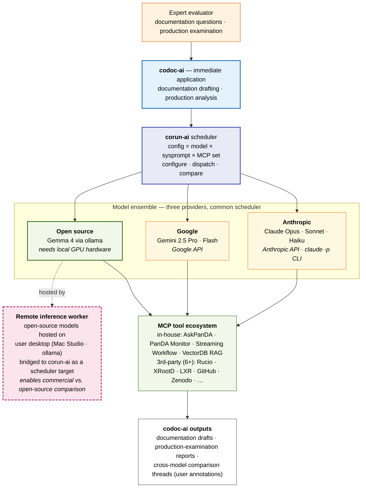

# diagram7_corunai_codocai

corun-ai + codoc-ai: the research orchestrator and its immediate
application, spanning frontier, commercial, and open-source models. The
open-source tier requires local hardware, which is why the team has
implemented a remote-inference bridge — open-source models run on the
user's desktop (Mac Studio / ollama) and plug into corun-ai as a
first-class dispatch target.

