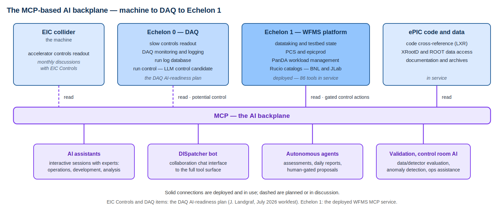

# E0-E1 Interface — Source Notes

Extracts from the primary sources on the E0-E1 interface, for reference by
the interface documents in this repository. Each extract cites its source;
the sources are authoritative, these notes are the working digest.

## Sources

- **Open questions discussion** — Echelon 0 - Echelon 1 Interface, Status
  and Open Questions, July 2026 Joint ePIC/EICUG Meeting (Landgraf,
  Battaglieri, Diefenthaler, Gunji):
  [Indico contribution](https://indico.bnl.gov/event/31808/contributions/126678/),
  [slides (PDF)](https://indico.bnl.gov/event/31808/contributions/126678/attachments/71377/122342/Diefenthaler-ePIC-E0-E1-Interface-20260715.pdf),
  [E0-E1 interface notes (running document)](https://docs.google.com/presentation/d/1hKGmzx91Q9FbFKKyMg_7TerNEVvY-8CxeAq6UINT1pc/).
- **DAQ overview** — Introduction & Streaming DAQ: Overview, Requirements
  and Timeline, J. Landgraf, July 2026 workfest:
  [Indico contribution](https://indico.bnl.gov/event/31808/contributions/126677/),
  [slides (pptx)](https://indico.bnl.gov/event/31808/contributions/126677/attachments/71365/122332/SRO_Echelon0_Summary.pptx).

## The interface open questions (July 2026)

Next step: formalize the E0-E1 interface in the Streaming Computing Model
report, with detailed technical notes as needed. Target: September 2026.

Main open questions as presented:

- Raw-data and STF definitions and timeline
- Evolution of the state model and transition rules
- Latency requirements
- Calibration and conditions databases
- Information and control interfaces between E0 and E1
- AI readiness and AI-enabled control

## The DAQ run-control model

From the DAQ overview (Echelon 0 software design):

- The state model incorporates continuously running components (scalers
  are the example).
- A "run" structure configures and selects the enabled detectors.
- Slow-controls status is part of the state model.

This is the E0-side model the
[E0-E1 state machine](e0-e1-state-machine.md) converges with.

## E0-E1 interface concepts (DAQ side)

- Time frames are buffers of multiplexed whole-detector data covering
  ~0.6 ms; super time frames are ordered, contiguous sets of O(1000) time
  frames, roughly 0.6 s of detector data.
- Likely independent DAQ systems, each with an independent STF stream:
  polarimetry (n × 1260 values, presented infrequently), luminosity
  detectors (n × 1260 values, each second), and the ePIC detector
  (100 Gbps).
- On run start/stop, the DAQ notifies orchestration of detector/collider
  status via message; on STF production it writes the file to the buffer
  box and notifies orchestration of data availability via message.
- Data banks: raw banks are produced by the readout, processing adds new
  banks without modifying existing ones, and a fraction of raw banks is
  always retained.
- Echelon 0 scale: O(100) readout computers in the DAQ room and O(100)
  computers at the SDCC data center for time frame building, high-level
  filters, archiving, monitoring, logging, and QA.

## The DAQ AI-readiness plan

From the DAQ overview (AI requirements): AI is not a project requirement
for the DAQ but is a potentially enormously useful tool for attaining the
project requirements; the group is searching for concrete ways to make the
electronics/DAQ "AI ready". The specific answers as of July 2026:

- Specific ML algorithms for specific features (e.g. dRICH dark current
  reduction in firmware).
- MCP servers to make data accessible to LLMs: slow controls readout,
  EIC Controls readout (monthly discussions with EIC Controls), DAQ
  monitoring/logging, and run log database information.
- MCP servers to provide APIs to allow LLMs (potentially) to control DAQ
  run control features.
- The SRO WG orchestration testbed as the model.

These items, together with the deployed Echelon 1 MCP service
(`swf-monitor/docs/MCP.md`), define the MCP-based AI backplane spanning
machine, DAQ, and E1:

