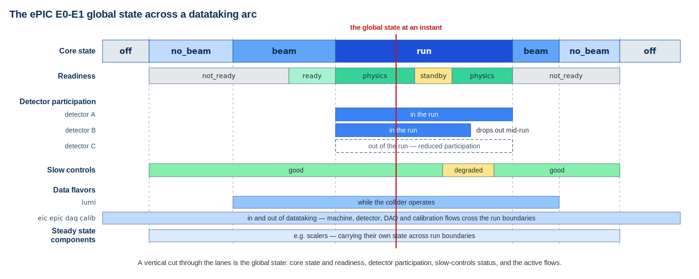

# The ePIC E0-E1 Interface

The E0-E1 interface is the boundary between Echelon 0 — the ePIC detector
and its data acquisition system (DAQ), the domain of the experimental
facility — and Echelon 1, the host-laboratory computing domain at BNL and
JLab. It is where streaming data, datataking state, and operational
control pass between the detector world and the computing world, and where
workflow management system (WFMS) responsibility begins.

This document states the interface as understood in mid 2026: the agreed
architecture, the definitions and mechanisms in hand, the working
realization in the streaming workflow testbed, and the open questions and
development path. It is prepared as input to the formalization of the
interface in the ePIC Streaming Computing Model report (target September
2026, set at the July 2026 collaboration meeting) and to the October 2026
ePIC Software and Computing review. The previous review identified the
E0-E1 interface as a key risk: a streaming experiment depends critically
on this interface, and streaming experiments are recent enough in nuclear
and particle physics that the territory is not well trodden.

The questions presented at the July 2026 joint Streaming DAQ and
Computing workfest are the working agenda for the formalization:

- Raw-data and super time frame definitions and timeline
- Evolution of the state model and transition rules
- Latency requirements
- Calibration and conditions databases
- Information and control interfaces between E0 and E1
- AI readiness and AI-enabled control

These questions map closely onto the elements catalogued in the January
2026 interface notes, which remain the reference inventory. The sections
below cover the architecture and the Echelon 0 context first, then the
question areas in turn.

## Architecture

The DAQ is one system spanning two facilities: the DAQ room at IP6 and
the DAQ enclave in the BNL data center, connected at 4 Tbps. Time frames
are built into super time frames in the enclave, and the files land in
the DAQ exit buffer, sized for about 72 hours of datataking. The buffer
extends onto an external subnet for Echelon 1 delivery; this outward face
is the piece of Echelon 0 that the post-DAQ world sees, and the defined
point where Echelon 1 picks up the datataking stream, as STF files.

Echelon 1 comprises the two host laboratories, each providing buffer,
archive, prompt processing, and fast monitoring, with jointly hosted
services — Rucio data management, PanDA workload management, AI services,
databases — spanning them. Raw data reaches both E1 sites (the butterfly
model), with JLab fed over ESnet at 400 Gbps. The WFMS requirements
state that the two E1s operate as one integrated distributed system with
failover: if one E1 goes down, the other takes over. Two dataflows and
the control messaging cross the boundary; they are described in the
sections below.

The architecture in one view (the ePIC computing model diagram, July
2026):

Data scale: roughly 2 Tb/s digitized at the detector against an output
requirement of about 100 Gb/s recorded, with a maximum deep inelastic
scattering rate of ~500 kHz against the 98.5 MHz bunch-crossing clock.
Noise and backgrounds can dominate: synchrotron radiation in the silicon
vertex tracker alone can approach 450 Gb/s into DAQ computing at the
highest-luminosity 18 GeV running, and dRICH dark-current rates after
radiation damage require a high-level filter. The DAQ group is
correspondingly open to Echelon 0 or early Echelon 1 data reduction,
including a software trigger — which makes the location where raw data is
finalized itself a boundary question.

## Echelon 0

The E0 side of the interface, from the DAQ overview at the July 2026
workfest:

- **Scale.** About 30 detectors read out through ~2500 readout boards
  (RDOs), ~120 data aggregation boards (DAMs), and a global timing unit
  (GTU). Echelon 0 computing is O(100) readout computers in the DAQ room
  plus O(100) computers at the SDCC data center for time frame building,
  high-level filters, archiving, monitoring, logging, and QA.
- **Run-control model.** The state model incorporates continuously
  running components (scalers are the example); a "run" structure
  configures and selects the enabled detectors; slow-controls status is
  part of the state model. This is the E0-side model that the E0-E1
  state machine (below) converges with.
- **Data banks.** Raw banks produced by the readout are formatted but
  never modified; processing — data reduction or enrichment — produces
  new banks; a fraction of raw banks is always retained. This is the
  provenance substrate at the data level.
- **Timing.** ASICs report hit times against a synchronization signal;
  the DAQ-provided time function is measured in EIC bunch crossings
  relative to the time frame start, with per-detector functions mapping
  channel, clock cycle, and fine counter to a time value. Bunch-dependent
  polarization requires event data and luminosity monitoring resolved to
  the bunch crossing, for each of the 1260 bunches.
- **Timeline.** Electronics and DAQ are working toward a final design
  review in early 2027. DAQ releases: PicoDAQ (FY26Q2, basic readout test
  setups), MicroDAQ (FY27Q1, engineering-article test stands, including
  Echelon 0 computing installed at SCDF), MiniDAQ (FY28Q1, full hardware
  and timing chain), Full DAQ-v1 (FY29Q2, ready for system integration),
  Production DAQ (FY31Q3, cosmics), against detector installation
  FY29Q2-FY31Q2. Neither PicoDAQ nor MicroDAQ has a direct interface
  between detector components and Echelon 1, but this does not prevent
  DAQ participation in interface test stands — for example implementing
  the DAQ side of transfer interfaces for the orchestration testbed.

Two E0 commitments bear directly on interface development. A DAQ
proto-enclave at SDCC around the end of calendar 2026 — a few computers
that can exercise the interface against testbeds of interest — and the
prospect of making the E0-E1 interface part of DAQ proper, with run
control and file sending, eventually replacing the testbed's DAQ
simulator with a DAQ-owned simulator. That transfer would make the
interface bilateral: each side owning and expressing its own half.

## Data across the interface

**Definitions.** A time frame (TF) is the multiplexed data of the entire
detector for 2^16 bunch crossings, approximately 0.665 ms, deliberately
not synchronized to bunch 0 so that edge effects are decorrelated from
spin states. All detectors are built into each TF. A super time frame
(STF) is an ordered, contiguous set of O(1000) TFs — roughly 0.6 s of
detector data, of order 2 GB — and is the unit of registration, transfer,
bookkeeping, and bulk processing. TFs are not transmitted in isolation;
the STF is what crosses the interface as a file.

A terminology hazard, flagged on the DAQ side: "time frame" is informally
overloaded. MAPS integration periods (2-8 µs), the organizing unit of
much simulation work, and ASIC synchronization periods are both also
called time frames. The interface definition pins the term to the DAQ TF
above; the other senses should be named distinctly in interface
documents.

**Independent DAQ systems.** Polarimetry and luminosity detectors run as
independent DAQ systems with their own STF streams (n×1260 values,
presented infrequently and each second respectively) alongside the ePIC
detector stream. Special-case streams copy into the main stream while
retaining independent uses.

**Two dataflows leave the exit buffer.** The STF stream is the complete
raw data: files registered in Rucio at the exit buffer and delivered to
the E1 buffers at both sites; reliable, with latency of minutes. The TF
stream is a fast subsample at finer granularity, delivered by messaging
or direct XRootD reads against the exit buffer within seconds; it feeds
fast monitoring and fast processing, and does not implement retention.
The two flows serve different consumers and carry different completeness
semantics; keeping those semantics distinct — what a consumer may infer
from a fast-path sample versus a verified complete STF — is a
formalization requirement.

A TF stream direct from DAQ to downstream consumers such as fast
calibration is under discussion.

The WFMS requirements state further obligations at the boundary.
Archiving and processing are triggered independently and simultaneously
as data is ingested, with no possibility of processing blocking
archiving. The complete copies arriving and archived at the two E1
centers are promptly validated, with a continuously communicated running
checksum maintained between them, and the stream is continuously sampled
and validated against independent DAQ and conditions metadata as an
early alarm for corruption and stream faults.

The TF/STF picture in one view (figure maintained in the WFMS
documentation):

**Proto-STF exercise.** The testbed has processed official ePIC DIS
10×100 timeframe simulation files through a real EICrecon payload
(200 MB and 40 events per file without zero suppression, ~5 s/event) —
prototyping the STF format question with real data. The format itself —
zero suppression, file sizing toward the nominal 2 GB — remains open.

## State across the interface

The datataking state model is a set of states and substates describing
collider, detector, DAQ and calibration state, maintained in a database
that is definitive in E0 and mirrored in real time in E1, and carried as
operational metadata on the data and messages crossing the interface,
in STF filenames/files and in the message metadata of every STF notification.
Downstream consumers can read state from the datataking context of the data
they are handling. They can read current system state from distributed services
such as MCP (Model Context Protocol). Integration with the
detector/data state machine is a
stated WFMS requirement, as is always-on streaming: accelerator and
detector information flows outside the running state, with processing
suspending and resuming on state and stream activity, the behavior the
data-flavor substates and steady state components carry. 

The first version of the model runs in the streaming workflow testbed,
which drives all activity via the state machine. The definition is maintained
independently of the implementation in the
[E0-E1 state machine document](e0-e1-state-machine.md), which also
carries the proposed evolution: generalizing the (state, substate) pair
to a global state incorporating the E0 run-control elements — detector
participation and slow-controls status, with the DAQ model's continuously
running components as steady state components — and treating state
changes as events appended to a queryable state history. The global
state across a datataking arc:

A multi-model AI research report (referenced below) carried the
evolution further with a proposed factorized structure, judged of high
enough quality to include here for consideration: the production state
as a product of
independently owned facets, with a single authority for each facet, an
append-only transition history, and derived operational views (such as
a physics-good flag) that are readable but not writable. The proposed
facet set:

| Facet | Example states | Authority |
|---|---|---|
| Machine/beam | absent, injection, tuning, stable, lost | Machine interface represented through E0 |
| Run control | idle, configuring, ready, starting, running, paused, stopping, closed, aborted | E0 run control |
| Acquisition mode | physics, dedicated calibration, embedded calibration, test | E0 run configuration |
| Detector partition | ready, acquiring, degraded, masked, fault | E0 detector control |
| STF lifecycle | forming through expired | E0, Rucio, and each E1 for their stages |
| E1 transfer | unknown, requested, transferring, verified, failed | Named E1/Rucio components |
| E1 processing | queued, running, completed, failed, cancelled | Named E1 workflow system |
| Conditions candidate | proposed, validating, approved, published, active, superseded, rejected | Conditions and calibration authorities |

In this model, only the owner changes a facet; consumers maintain
projections updated by monotonically increasing revisions, with a
mismatch triggering reconciliation rather than silent application. Each
transition record carries its owner, subject, previous and new revision,
transition type and reason, event and receipt times, configuration and
schema versions, correlation and causation identifiers, actor identity,
and a quality or confidence measure where the input is observational.

The single-hierarchy model in operation today cannot express common
combinations — beam present with the DAQ paused, a physics run with one
detector partition degraded, embedded calibration during normal
acquisition — which the facet product represents naturally. The
global-state proposal above is a step in this direction: detector
participation and slow-controls status are early facets, and the
steady state components are facets that persist across the run
lifecycle.

Open items: the complete transition table with triggering conditions,
event-driven transitions (a good-for-physics declaration, a fault
dropping the detector out of physics), the interaction of state with the
run boundary (a new run when the detector is in a new conditions state),
the evaluation of the proposed facet model for the governed state
machine definition, and the reconciliation with the DAQ run-control
model in one document, which this document set begins.

## Latency

Three latency regimes are identified, each with its consumers and its
serving mechanism in the two-dataflow structure above:

1. **Bulk prompt processing**: minutes (Rucio delivery time) to
   availability of complete STF files at the E1s, with prompt results
   over minutes to hours depending on processing load.
   Served by the STF stream.
2. **Fast path**: 10-30 s from datataking to availability of STF-scale
   statistics for fresh data, delivered to the control room and AI via
   streaming processing at the E1s; the WFMS documentation states O(10 s)
   for first results. Served by the TF-sample stream.
3. **Very low latency**: around one second and below — DAQ-internal,
   below the interface.

Behind these sits the streaming readout goal of reconstructed, calibrated
data to the collaboration within about three weeks of datataking, with
reconstruction turnaround driven by calibration turnaround. The
calibration program adds its own latency classes — seconds (prompt
feedback), minutes (run-by-run updates), hours (delayed or quasi-online)
— to be mapped onto the two dataflows and the state model's calibration
modes. The September 2026 formalization should state latencies with well
defined endpoints: from what event (e.g. data egress from DAQ) to what
event (a high stats plot displayed in the control room).

## Calibration and conditions databases

The July 2026 calibration sessions produced the most structured
requirements statement yet, with interface specifications as requirement
number one, scoped explicitly as E0-E1 / E1-E2: what data is produced
and consumed; calibration object format, metadata, versioning, validity
intervals. Infrastructure requirements follow — conditions database,
orchestration layer, possibly dedicated compute queues, monitoring and
control interfaces — then workflow placement (at which DAQ stage each
calibration runs; synchronous versus asynchronous), resource profiles,
and an autonomous calibration framework.

The calibration task taxonomy: standalone (between fills, laser, pulser),
physics-driven (track, vertex, and PID dependent), and iterative
(requiring previous constants or reconstruction-calibration loops), with
a dependency matrix and explicit identification of circular dependencies.
Tracking is the prerequisite for many calibrations.

The conditions database splits by side: E0 needs conditions gathering,
selective population, fast loading, and APIs to E0-only databases (raw
conditions, slow controls); E1 needs a robust distributed read API for
many clients and distributed writing for few. Its content spans
calibration measurements, distilled slow-controls parameters, and
alignment measurements. Whether this means one conditions database or
two remains open, as does whether the conditions database is the
mechanism for flowing downstream-refined calibrations back to E0. ePIC
has not yet taken up the conditions database in software and computing;
the intent is established, and the step awaits a use case that calls
for it. A candidate is identified: nopayloaddb, the HSF reference
conditions database implementation developed at BNL, which received a
preliminary and favorable ePIC evaluation in 2024. The E0-versus-E1
placement of calibrations was judged in January to be sociological more
than technical — with a good feedback loop there is no effective
difference — with the firm constraint that detector experts require
control wherever their calibration runs.

Concrete demonstrators are chosen. EEEMCal is the first testbed target:
calibration workflow prototypes starting from a file-based Snakemake
payload with a proto-interface to a calibration database, extending to
fast processing. SVT alignment provides the second: ER2 MOSAIX sensors
in a beam test at KEK PF-AR with NestDAQ, conversion to JANA2 over
ZeroMQ, and alignment algorithms adapted from existing tools — an
end-to-end streaming calibration workflow on real detector data.

SPINDLE (Streaming Physics INtelligence and Data Lifecycle Engine) is
the JLab program: an HPDF nuclear physics use case built on online
calibrations, with a five-stage lifecycle (monitoring, change detection,
reconstruction and calibration, validation and change-driver analysis,
calibration and conditions data with visualization) on autonomous
ERSAP+JANA2 workflows. 
SPINDLE identifies streaming orchestration (workflow and workload management
for streaming data) as the technology gap facing streaming readout
experiments and HPDF alike; this is the capability the testbed program
is building, and SPINDLE positions itself as complementary, with its
data-lifecycle focus.

## Information and control interfaces

**E0 to E1 is operational today**, in the testbed realization: the run
lifecycle (run imminent, start, pause and resume, end) is broadcast from
the DAQ simulator and drives downstream orchestration — dataset creation,
data transfers, processing task establishment, worker provisioning, run closeout.
STF availability notifications drive data handling.

**E1 to E0 is the open direction.** The use case is established —
adjusting detector thresholds or configuration on the basis of an E1
result, with AI control of hardware operational precedent at JLab — but
no E1-to-E0 control flow has been prototyped in ePIC. The
January notes call for defining the generic communications mechanism
(message queue, messages pointing to payloads, communicating servers on
each side) rather than per-calibration specifics. Beyond the
communication and information exchange mechanisms already in hand and
exercised in the testbed, E1-to-E0 control is primarily a cybersecurity
matter: too early to take up, and belonging more to the host facilities
than to ePIC software and computing. It is likely to be addressed in a
preliminary way when the DAQ sets up its first proto-enclave around the
end of 2026.

The July 2026 AI research on the interface presents a proposal
worth considering, organizing the
formalization into five planes, a candidate outline for the September
work:

1. **Data plane** — immutable STFs for complete raw data, plus
   explicitly sampled TF slices for low-latency processing.
2. **Event plane** — versioned lifecycle and availability events with
   stable identities, sequence numbers, timestamps, schema identifiers,
   and checksums.
3. **State plane** — an authoritative, factorized state model with a
   single owner for each state facet and append-only transition history.
4. **Intent and control plane** — recommendations and command intents
   from E1 to an E0-local gateway, with policy evaluation, approval,
   precondition checking, execution, and readback as separate stages.
5. **Provenance plane** — every consequential result carries a trace
   from observation through recommendation, approval, policy decision,
   action, and measured outcome.

Of these, the data and state planes have concrete artifacts (above), and
the event plane is the next definition target: the run lifecycle and
availability messages exist in the testbed vocabulary, and the interface
needs their contract — which changes are durable events, which authority
emits each, and what consumers may assume about identity, ordering,
completeness, and delivery. The intent/control and provenance planes
frame the E1-to-E0 direction: control crosses as attributable intents
subject to E0-local policy and enforcement, not as direct writes.

The event plane has had some discussion in the streaming computing model WG,
in the context of developing the WFMS requirements document, but it needs
dedicated discussion and a plan established, as it is an important
part of the interface. The WFMS requirements carry the elements stated
so far: workflows driven in real time by data-availability events, TF
and bunch-crossing identifiers monotonically increasing and unique for
the lifetime of the EIC, cataloged TF-to-bunch-crossing ranges so access
at either granularity resolves to its containing TF, immutability of
written TFs, and run-period records that may overlap, so a TF is not
uniquely owned by one run period.

## AI readiness and AI-enabled control

The July 2026 session recorded a consensus: no fundamental
objection to MCP as the common basis for AI integration of services
across the spectrum. The DAQ side has independently
written down the same architecture in its AI requirements: AI is not a
project requirement for the DAQ but a potentially very useful tool for
attaining the project requirements, with the concrete AI-readiness list
being specific ML algorithms for specific features (dRICH dark-current
reduction in firmware), MCP servers making DAQ data accessible to large
language models (slow controls readout, EIC controls readout, DAQ
monitoring and logging, run log database), and MCP servers providing
APIs through which LLMs could potentially control DAQ run-control
features — citing the orchestration testbed as the model to follow.

On the E1 side this is deployed: the testbed operates a comprehensive
MCP service over the full system state — runs, STFs, agents, workflows,
logs, PanDA, Rucio — used for both information and control, with agents
controllable equivalently from the CLI and from AI assistants. The
MCP-based AI backplane spanning machine, DAQ, Echelon 1 and global
computing (figure maintained with the MCP service documentation in
swf-monitor):

The proposed AI contract of the interface classifies every AI
interaction with the boundary as observation (reading through MCP),
recommendation (a proposal record), approval (a human or policy gate),
or action (logged, provenance-stamped execution). The vocabulary has
operational precedent: the production side of the WFMS platform runs it
today — an action stream recording who did what to what
with outcome and provenance, AI proposals with human approval and
deterministic execution, and button-gated credentialed operations. The
research direction sharpens the boundary-grade version: MCP serves as a
typed access layer over authoritative systems, tool exposure does not
transfer authority, and authorization and safety enforcement remain with
the local (E0) control system. Consequential detector action stays
subject to local deterministic enforcement regardless of what proposes
it.

## The testbed realization

The streaming workflow testbed is the working expression of the
interface: a simulated DAQ expresses the E0 side (run lifecycle, STF
stream, state metadata), and the data, processing, and fast-monitoring
agents express the E1 side, on real services — PanDA, Rucio, ActiveMQ,
the monitor. Both baseline workflows run routinely, including in continuous
integration:

- **Prompt STF processing**: run-imminent creates the Rucio run dataset;
  arriving STFs are registered and attached; a PanDA task per E1
  consumes its site's subset dataset as it fills. A decision box will
  encode ePIC and facility policy as Rucio dataset membership — the
  data agent at the exit buffer can examine each STF on arrival and
  attach it to BNL, JLab, both, or neither — so prompt processing is
  per-Echelon-1 by construction, and policy is informed by data, not only
  metadata-driven.
- **Fast TF processing**: TF samples skimmed from STFs, divided into
  slices, distributed to a standing pool of persistent PanDA workers pre-provisioned
  at run start through iDDS and Harvester, running EICrecon as a persistent process
  fed over ZeroMQ with streaming input over XRootD.

State rides every STF message and filename, so downstream consumers and
AI tools always know the datataking context of the data in hand.
Containerized deployment (docker-compose of the testbed, PanDA in a box)
makes the testbed reproducible beyond its home installation — directly
relevant to exercising the interface against the DAQ proto-enclave.

## Development targets

A time order is not implied.

- **September 2026** — formalize the interface in the current V3 draft
  Streaming Computing Model report; this document is one input to its writing.
- **State machine convergence** — complete the transition table, add
  event-driven transitions, weigh the proposed factorized facet model,
  and reconcile the testbed model with the DAQ run-control model in the
  governed definition; realize the state database and its E1 mirror with
  a read API.
- **Event plane definition** — specify the event contract for the run
  lifecycle and data availability vocabulary the testbed already
  operates.
- **Calibration** — EEEMCal calibration prototype with a
  proto-interface to a calibration database; SVT alignment demonstrator;
  the nopayloaddb conversation; definition (and naming) of the generic
  intra-run communications mechanism.
- **E0 E1 integrated testing** — exercise the interface against the DAQ
  proto-enclave at SDCC; prepare the testbed to swap its DAQ simulator
  for a DAQ-owned simulator.
- **Documentation** — the WFMS documentation covers the datataking state
  machine, the status of the conditions database and of E1-to-E0
  control; the AI contract of the boundary remains to be documented.

## Producing this document

An AI (Anthropic Claude Fable 5, xhigh reasoning setting) was tasked with
taking the references and artifacts
cited below, and human guidance (T. Wenaus), as inputs and producing a draft of
this document. Many human-AI iterations followed
to refine the draft. When it was satisfactory, Wenaus went through the full 
draft and edited by hand.

## Interface artifacts

The concrete artifacts of the interface definition, July 2026:

- [ePIC computing model diagram](https://epic-wfms-docs.readthedocs.io/en/latest/foundations/)
  — the architecture in one view, with the E0-E1 interface detail;
  maintained in the WFMS documentation.
- [E0-E1 state machine](e0-e1-state-machine.md) — the governed
  definition of the datataking state model and its proposed evolution.
- [E0-E1 global state diagram](images/e0-e1-global-state-v1.svg) — the
  global state across a datataking arc.
- [E0-E1 interface source notes](e0-e1-interface-source-notes.md) —
  extracts from the primary sources, the working digest for this
  document set.
- [TF/STF explainer](https://epic-wfms-docs.readthedocs.io/en/latest/streaming/#time-frames-and-super-time-frames)
  — the two data units and the sampling and streaming paths, in the WFMS
  documentation.
- [MCP AI backplane diagram](https://raw.githubusercontent.com/BNLNPPS/swf-monitor/infra/baseline-v39/docs/mcp-ai-backplane-v1.svg)
  — AI integration spanning machine, DAQ, Echelon 1 and global
  computing, maintained with the
  [MCP service documentation](https://github.com/BNLNPPS/swf-monitor/blob/infra/baseline-v39/docs/MCP.md).

## Sources

- [E0-E1 interface notes, January 2026](https://docs.google.com/presentation/d/1hKGmzx91Q9FbFKKyMg_7TerNEVvY-8CxeAq6UINT1pc/)
  — the elements catalogue from the January collaboration meeting
  session.
- [Echelon 0 - Echelon 1 Interface, Status and Open Questions](https://indico.bnl.gov/event/31808/contributions/126678/)
  (Landgraf, Battaglieri, Diefenthaler, Gunji), July 2026 workfest — the
  open questions and the September formalization target.
- [Introduction & Streaming DAQ: Overview, Requirements and Timeline](https://indico.bnl.gov/event/31808/contributions/126677/)
  (Landgraf), July 2026 workfest — Echelon 0 architecture, definitions,
  run-control model, AI requirements, timeline.
- [BNL Orchestration Testbed](https://indico.bnl.gov/event/31808/contributions/126683/)
  (Kalinkin et al.), July 2026 workfest — the testbed realization.
- [SRO Calibrations](https://indico.bnl.gov/event/31808/contributions/126692/)
  (Battaglieri, Gunji), July 2026 workfest — calibration workflow
  requirements and demonstrators.
- [SPINDLE](https://indico.bnl.gov/event/31808/contributions/126681/)
  (Diefenthaler, Jeske), July 2026 workfest — the JLab HPDF online
  calibrations program.
- [Orchestration of TF Processing with PanDA and Rucio](https://indico.bnl.gov/event/30532/contributions/118848/)
  (NPPS), January 2026 collaboration meeting — the interface schematic
  and first orchestration chain.
- [ePIC WFMS documentation, Streaming Workflows](https://epic-wfms-docs.readthedocs.io/en/latest/streaming/)
  — the interface dataflows, units, workflows, and testbed realization.
- [The ePIC Streaming Computing Model](https://zenodo.org/records/14675920)
  — the publication the September formalization targets.
- [Requirements for an ePIC Distributed Workflow Management System](https://www.overleaf.com/project/67bdf89a3d44a138da503dea)
  (Diefenthaler, Wenaus, and the ePIC Streaming Computing Model Working
  Group, v1.0, October 2025) — the WFMS requirements, including the
  streaming-processing, state-machine, and data-integrity obligations at
  the interface.
- [AI-ready information and control boundary between E0 and E1 — AI research report](https://etaverse.com/tjai/p/research-ai-ready-e0-e1-information-control-boundary-chatgpt/)
  (July 2026 multi-model research) — the five-plane organization, the
  factorized state model, and the control analysis drawn on above.
