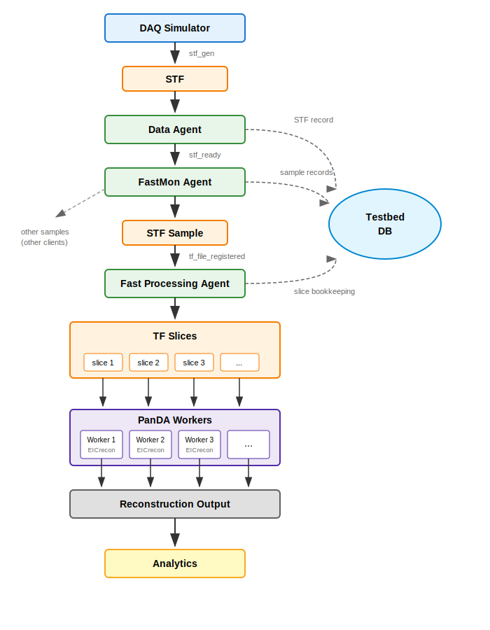
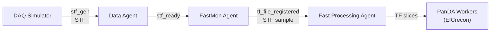
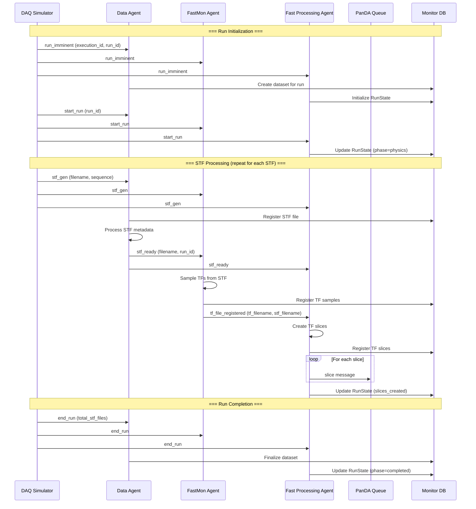
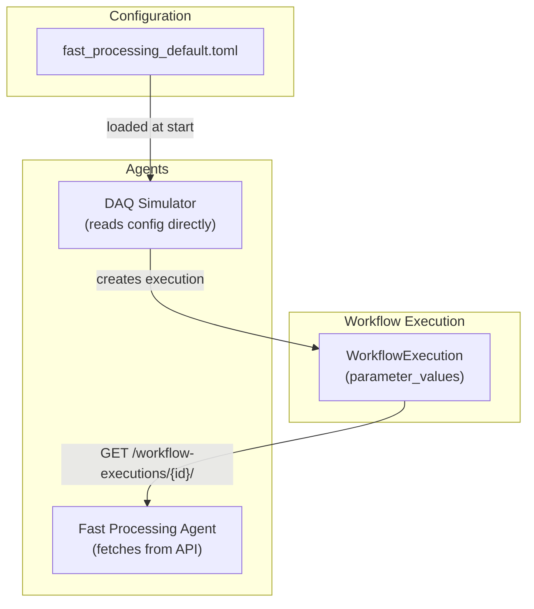
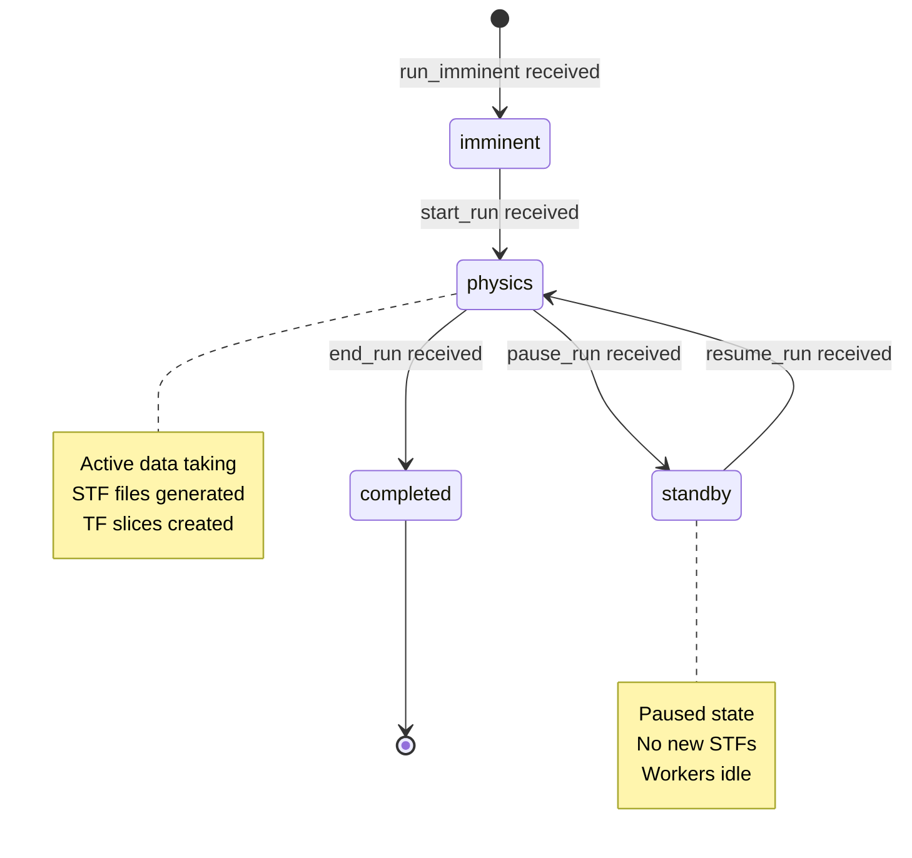
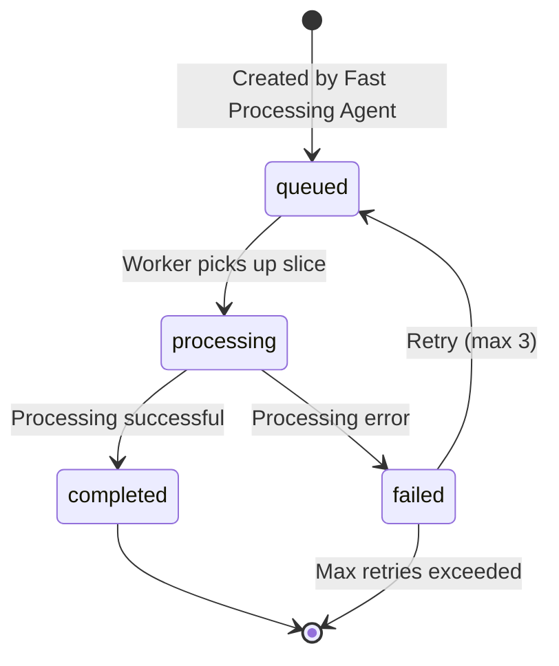

# Fast Processing Workflow

This document describes the fast processing workflow for near real-time detector data processing via PanDA/iDDS workers.

## Overview

The fast processing workflow enables rapid processing of detector data by:
1. Simulating DAQ data taking (STF generation)
2. Sampling Time Frames (TF) from Super Time Frames (STF)
3. Creating TF slices for parallel processing
4. Distributing slices to PanDA workers running reconstruction payloads

### Pipeline Overview



**Worker Payload:** Each PanDA worker receives a TF slice as input and runs a reconstruction payload. Currently the payload is a placeholder; in production it will be EICrecon for ePIC detector reconstruction.

## Message Flow

### Agent Pipeline



### Complete Workflow Sequence



## Data Products

### Hierarchy

```
Run (run_id: 101993)
├── STF Files (Super Time Frames)
│   ├── swf.101993.000001.stf
│   ├── swf.101993.000002.stf
│   └── swf.101993.000003.stf
│
├── TF Samples (Time Frame samples from FastMon)
│   ├── swf.101993.000001_tf_001.tf
│   ├── swf.101993.000001_tf_002.tf
│   └── ...
│
└── TF Slices (for PanDA workers)
    ├── swf.101993.000001_slice_000.tf
    ├── swf.101993.000001_slice_001.tf
    └── ... (15 slices per STF sample)
```

### Data Product Details

| Product | Created By | Stored In | Purpose |
|---------|-----------|-----------|---------|
| **STF File** | DAQ Simulator | STFFile table | Raw detector data unit |
| **TF Sample** | FastMon Agent | FastMonFile table | Sampled subset for fast monitoring |
| **TF Slice** | Fast Processing Agent | TFSlice table | Processing unit for PanDA workers |

## Message Types

### Broadcast Messages (DAQ Simulator → All Agents)

| Message | Payload | Purpose |
|---------|---------|---------|
| `run_imminent` | `execution_id`, `run_id`, `workflow_params` | Prepare for new run |
| `start_run` | `run_id`, `state=physics` | Begin data taking |
| `stf_gen` | `filename`, `sequence`, `run_id` | New STF available |
| `pause_run` | `run_id` | Temporary halt |
| `resume_run` | `run_id` | Resume from pause |
| `end_run` | `run_id`, `total_stf_files` | Run complete |

### Agent-to-Agent Messages

| Message | From | To | Payload |
|---------|------|----|---------|
| `stf_ready` | Data Agent | FastMon, Fast Processing | `filename`, `checksum`, `size_bytes` |
| `tf_file_registered` | FastMon Agent | Fast Processing Agent | `tf_filename`, `stf_filename`, `tf_count` |

### Queue Messages (Fast Processing → PanDA)

| Message | Destination | Payload |
|---------|-------------|---------|
| `slice` | `/queue/panda.transformer.slices` | `slice_id`, `tf_filename`, `start`, `end`, `tf_count` |

## Configuration

### fast_processing_default.toml

```toml
[testbed]
namespace = "torre2"

[agents.data]
enabled = true

[agents.fastmon]
enabled = true

[agents.fast_processing]
enabled = true

[fast_processing]
stf_count = 10              # STF files to generate
physics_period_count = 1    # Physics periods per run
target_worker_count = 30    # Target PanDA workers
stf_sampling_rate = 1.0     # Fraction of STFs to sample (1.0 = 100%)
slices_per_sample = 15      # TF slices per STF sample
slice_processing_time = 30  # Seconds per slice (for planning)
```

### Workflow Parameters Flow



## State Transitions

### RunState Lifecycle



### TF Slice Lifecycle



## Monitoring

### Key Metrics

| Metric | Source | Purpose |
|--------|--------|---------|
| `stf_count` | WorkflowExecution | Total STFs in run |
| `tf_files_received` | Fast Processing Agent | TF samples processed |
| `slices_created` | RunState | Total slices generated |
| `slices_queued` | RunState | Slices waiting for workers |
| `slices_completed` | RunState | Successfully processed |

### Monitoring Queries (MCP)

```python
# Workflow status
get_workflow_monitor(execution_id='stf_datataking-wenauseic-0049')

# Messages during execution
list_messages(execution_id='stf_datataking-wenauseic-0049')

# STF files for a run
list_stf_files(run_number=101993)

# TF slices for a run
list_tf_slices(run_number=101993)

# Agent logs
list_logs(execution_id='stf_datataking-wenauseic-0049')
```

## Example Execution

From a recent test run (execution `stf_datataking-wenauseic-0049`):

```
Run 101993 Summary:
├── Duration: ~14 seconds
├── STF files: 3 (all processed)
├── Messages:
│   ├── run_imminent → all agents prepared
│   ├── start_run → physics phase began
│   ├── stf_gen (x3) → STF files generated
│   ├── stf_ready (x3) → Data Agent processed
│   └── end_run → Run completed
└── Agents involved:
    ├── daq_simulator-agent-wenauseic-484
    ├── data-agent-wenauseic-481
    ├── fastmon-agent-wenauseic-482
    └── fast_processing-agent-wenauseic-483
```

## See Also

- [Agent Management](agent-management.md) - Starting and stopping agents
- [Architecture Overview](architecture.md) - System design
- [Operations Guide](operations.md) - Day-to-day operations
