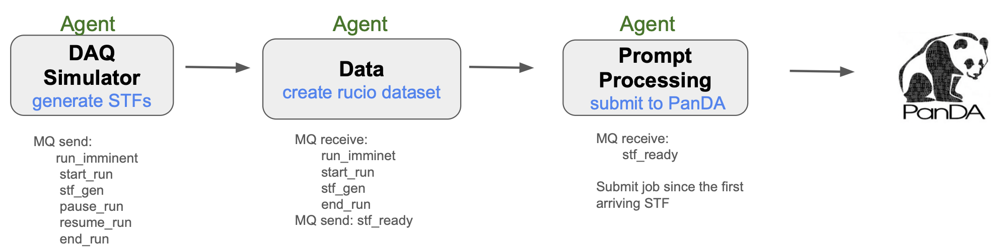

# Prompt Processing Workflow

This document describes the prompt processing workflow for STF (Super Time Frame) files via PanDA/iDDS workers.

## Overview

The prompt processing workflow enables rapid processing of detector data by:
1. Simulating DAQ data taking (STF generation)
2. Processing STF files through the Data Agent
3. Submitting STF files to PanDA for batch processing

### Pipeline Overview



## Data Products

### Hierarchy

```
Run (run_id: 102363)
├── Dataset: swf.102363.run
│   ├── STF Files (Super Time Frames)
│   │   ├── swf.102363.000001.stf
│   │   ├── swf.102363.000002.stf
│   │   └── ... ...
│   │
│   └── PanDA Task
│       └── Processes all STF files in dataset
```

### Data Product Details

| Product | Created By | Stored In | Purpose |
|---------|-----------|-----------|---------|
| **STF File** | DAQ Simulator | STFFile table | Raw detector data unit |
| **Dataset** |  Data Agent | Rucio | Collection of STF files for a run |
| **PanDA Task** | Prompt Processing Agent | PanDA | Batch/Grid processing jobs |

## Message Types

### Broadcast Messages (DAQ Simulator → All Agents)

| Message | Payload | Purpose |
|---------|---------|---------|
| `run_imminent` | `execution_id`, `run_id`, `dataset` | Prepare for new run |
| `start_run` | `run_id`, `state=run`, `substate=physics` | Begin data taking |
| `stf_gen` | `filename`, `sequence`, `run_id` | New STF available |
| `pause_run` | `run_id` | Temporary halt (standby) |
| `resume_run` | `run_id` | Resume from pause |
| `end_run` | `run_id`, `total_stf_files` | Run complete |

## Configuration

### prompt_processing_default.toml

```toml
[testbed]
namespace = "user-namespace"

[workflow]
name = "prompt_processing"
version = "1.0"
description = "Prompt processing of STF files"
includes = ["daq_state_machine.toml"]

[agents.stf-data]
enabled = true
script = "agents/data_agent.py"

[agents.stf-processing]
enabled = true
script = "agents/prompt_processing_agent.py"

[simulation]
# STF generation parameters
stf_count = 10                   # Number of STF files to generate
physics_period_count = 1        # Number of physics periods

# Timing parameters
realtime = true                 # Run in real-time (1 sim second = 1 wall second)

[prompt_processing]
# Optional shared output root for STF files. Leave empty in shared configs and
# override per user via SWF_TESTBED_CONFIG or SWF_PROMPT_PROCESSING_CONTAINER.
container = ""
```

### Per-user output directory

Do not hard-code a personal path such as `/data/user_name/STFfiles` in the shared workflow config.

Use one of these per-user override mechanisms instead:

```bash
export SWF_PROMPT_PROCESSING_CONTAINER=/data/user_name/datafolder
testbed run prompt_processing
```

Or create a personal testbed config and point `SWF_TESTBED_CONFIG` at it:

```toml
[prompt_processing]
container = "/data/user_name/datafolder"
```

The workflow resolves the STF output directory in this order:
1. Explicit workflow argument
2. `[prompt_processing].container` from the merged config
3. `SWF_PROMPT_PROCESSING_CONTAINER`
4. `/tmp`

## Running the Workflow

### Prerequisites

#### PanDA Setup
- Use `--vo` option with value `"epic"`
- For BNL PanDA submission, you need a **valid OIDC token issued by IAM**

#### Install panda-client
```bash
# Create a venv
python3 -m venv pclient
source pclient/bin/activate
pip install panda-client
```

#### Configure panda-client
```bash
mkdir -p pclient/run
cd pclient/run/
```

**setup.sh example:**
```bash
source /etc/panda/panda_setup.sh
export PANDA_URL_SSL=https://pandaserver01.sdcc.bnl.gov:25443/server/panda
export PANDA_URL=https://pandaserver01.sdcc.bnl.gov:25443/server/panda
export PANDACACHE_URL=https://pandaserver01.sdcc.bnl.gov:25443/server/panda
export PANDAMON_URL=https://pandamon01.sdcc.bnl.gov
export PANDA_AUTH=oidc
export PANDA_AUTH_VO=EIC
export PANDA_USE_NATIVE_HTTPLIB=1
export PANDA_BEHIND_REAL_LB=1
```

### Execution Methods

#### Option 1: Start Individually in CLI Mode
```bash
cd swf-testbed
python agents/data_agent.py
python agents/prompt_processing_agent.py
```
- The agent subscribes to ActiveMQ `/topic/epictopic`
- When a `stf_ready` message is broadcasted, the agent submits the task to PanDA

#### Option 2: Start via Workflow Orchestrator
Both `prompt-processing-agent` and `data-agent` can be started together:
```bash
testbed run prompt_processing
```

### Agent Configuration

#### Add Agents to supervisord (`agents.supervisord.conf`)
```ini
[program:stf-data-agent]
command=python -u agents/data_agent.py -v
directory=%(ENV_SWF_HOME)s/swf-testbed
environment=SWF_TESTBED_CONFIG="%(ENV_SWF_TESTBED_CONFIG)s"
autostart=false
autorestart=true
stopwaitsecs=10
stopsignal=QUIT
stdout_logfile=%(here)s/logs/%(program_name)s.log
stderr_logfile=%(here)s/logs/%(program_name)s.log

[program:stf-processing-agent]
command=python -u agents/prompt_processing_agent.py -v
directory=%(ENV_SWF_HOME)s/swf-testbed
environment=SWF_TESTBED_CONFIG="%(ENV_SWF_TESTBED_CONFIG)s"
autostart=false
autorestart=true
stopwaitsecs=10
stopsignal=QUIT
stdout_logfile=%(here)s/logs/%(program_name)s.log
stderr_logfile=%(here)s/logs/%(program_name)s.log
```

## Monitoring

### Key Metrics

| Metric | Source | Purpose |
|--------|--------|---------|
| `stf_count` | WorkflowExecution | Total STFs in run |
| `total_stf_files` | end_run message | STF files generated |
| `dataset_status` | Processing Agent | Rucio dataset state |
| `jediTaskID` | PanDA submission | Task identifier |

### Monitoring Dashboards

- **SWF Monitor**: https://pandaserver02.sdcc.bnl.gov/swf-monitor

### Monitoring Queries (MCP)

```python
# Workflow status
get_workflow_monitor(execution_id='prompt_processing-username-xxxx')

# Messages during execution
list_messages(execution_id='prompt_processing-username-xxxx')

# STF files for a run
list_stf_files(run_number=102363)

# Agent logs
list_logs(execution_id='prompt_processing-username-xxxx')

# PanDA jobs for a task
panda_list_jobs(taskid=12345)
```

## Example Execution

A typical prompt processing run:

```
Run 102363 Summary:
├── Duration: ~10 seconds (simulation time)
├── STF files: 2
├── Dataset: swf.102363.run
├── Messages:
│   ├── run_imminent → agents prepared
│   ├── start_run → physics phase began
│   ├── stf_gen (x2) → STF files generated
│   └── end_run → Dataset closed, PanDA submitted
├── Agents involved:
│   ├── daq_simulator-agent-username-XXX
│   ├── data-agent-username-XXX
│   └── prompt-processing-agent-username-XXX
└── PanDA:
    └── Single task submitted for entire dataset
```

## See Also

- [Agent Management](agent-management.md) - Starting and stopping agents
- [Architecture Overview](architecture.md) - System design
- [Operations Guide](operations.md) - Day-to-day operations
