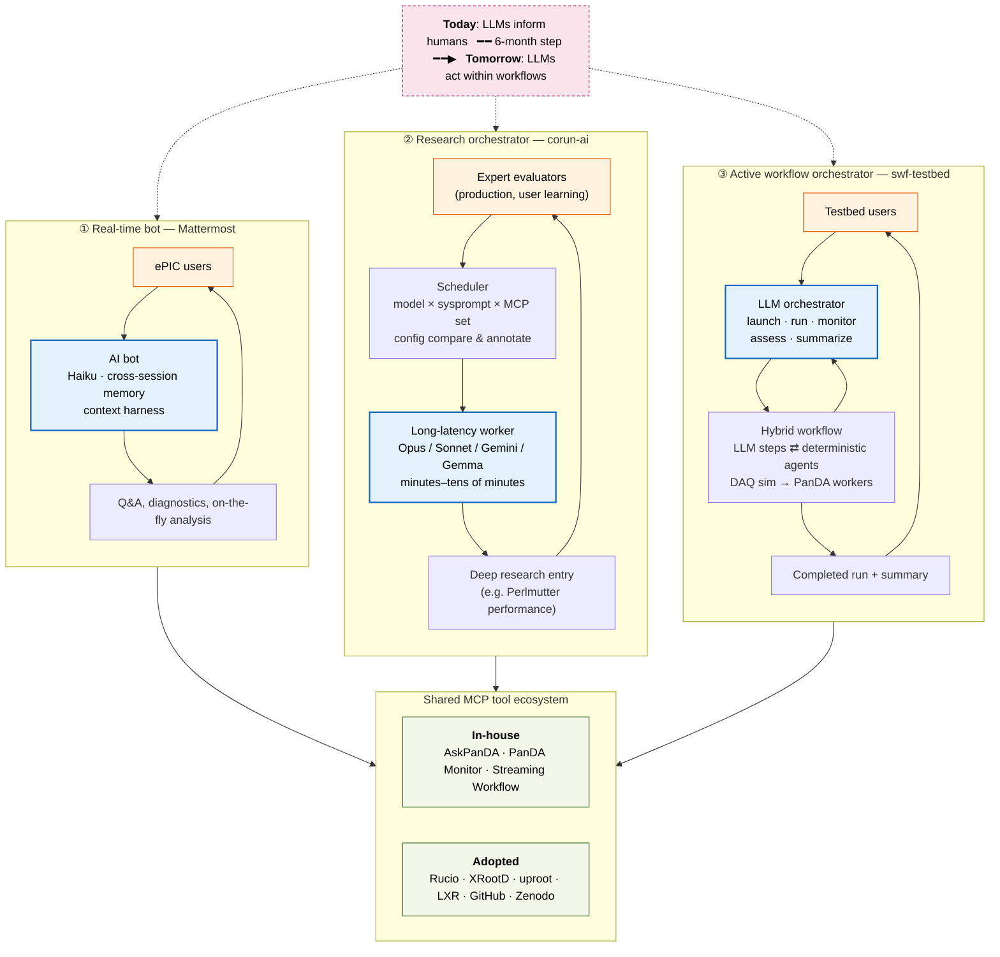
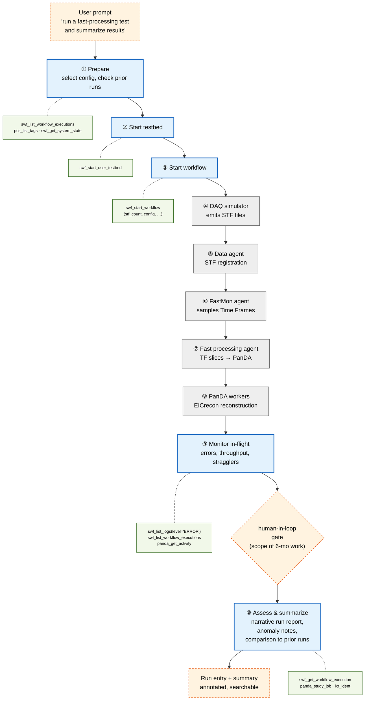
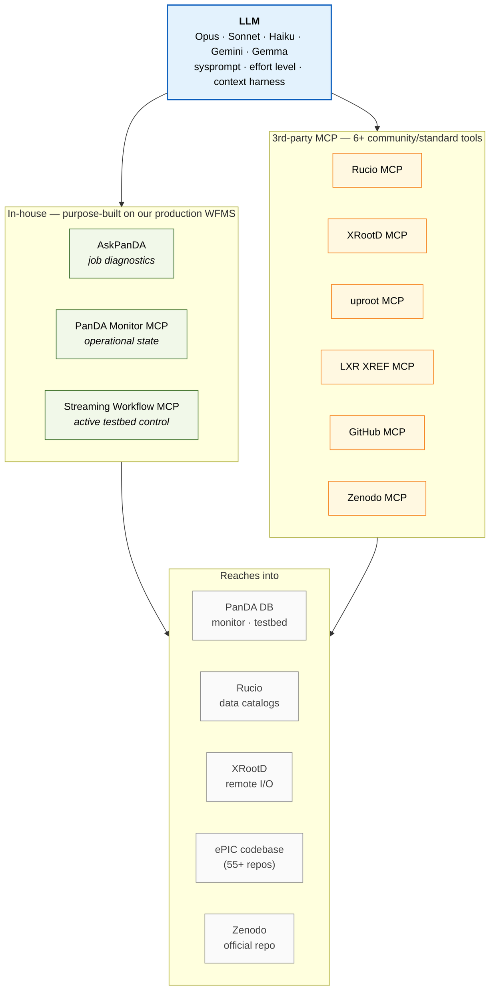
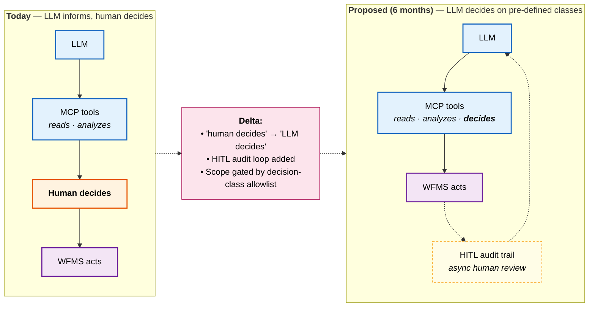
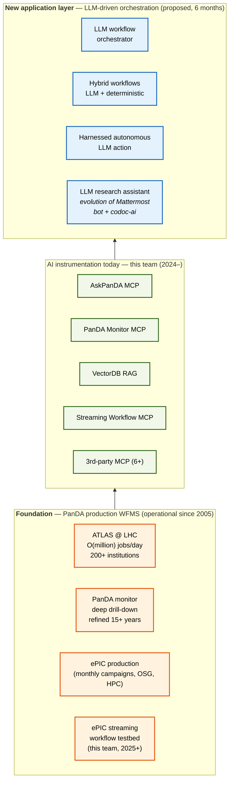
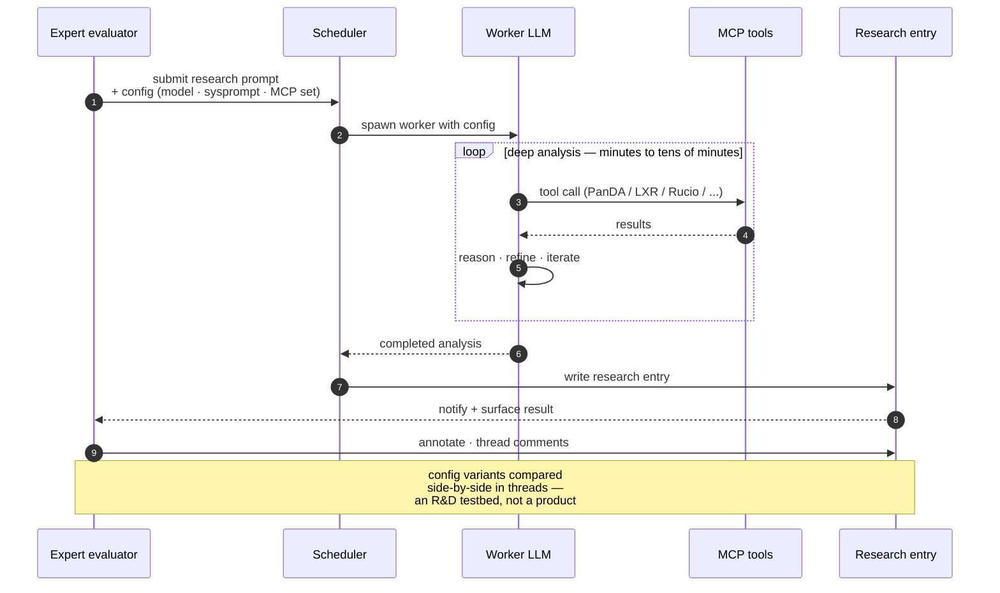

# AI-enabled WFMS proposal — draft diagrams

Mermaid prototypes to support the "Why us?" section. Finished versions will
graduate to hand-authored SVG in `swf-testbed/docs/images/` style.

Open this file's preview (`Ctrl+Shift+V`) to render.

---

## Diagram 1 — Three Contexts

The thesis picture: three LLM-integrated systems running today, ordered
left-to-right by increasing LLM autonomy. Shared MCP ecosystem feeds all
three. Top banner carries the 6-month claim.

Legend: blue = LLM, orange = human, green = MCP/tool surface, pink-dashed = thesis / 6-month delta.

---

## Diagram 3 — Hybrid Workflow Anatomy

One real swf-testbed streaming run as a pipeline of alternating LLM and
deterministic steps, with the MCP tools each LLM step actually calls.
Human-in-loop gate between ⑨ and ⑩ is where the 6-month scope lands.

Legend: blue = LLM step, grey = deterministic agent, dashed orange = human-in-loop / user edge, green captions = MCP tool calls.

---

## Diagram 2 — MCP Tool Ecosystem

One LLM reaches into the experiment's operational stack through a two-tier
tool set. Counters "everyone has MCP now" by showing depth into production
systems.

---

## Diagram 4 — 6-month Delta (before / after)

Same boxes, one arrow moves, one audit loop added. Makes the project
feel like a bounded increment on an operational system, not a research
leap.

---

## Diagram 5 — PanDA Scale Provenance

The "why 6 months is plausible" anchor: we're layering on a production
WFMS with a decade of operational history, not starting from zero.

---

## Diagram 6 — corun-ai Research Loop

Shows corun-ai as an orchestrated research system, not a chatbot.
Config-compare in annotation threads is the R&D-testbed feature.

---

Fill in concrete numbers (PanDA jobs/day, testbed run count, corun-ai prompt count, etc.) before these go into proposal figures.
